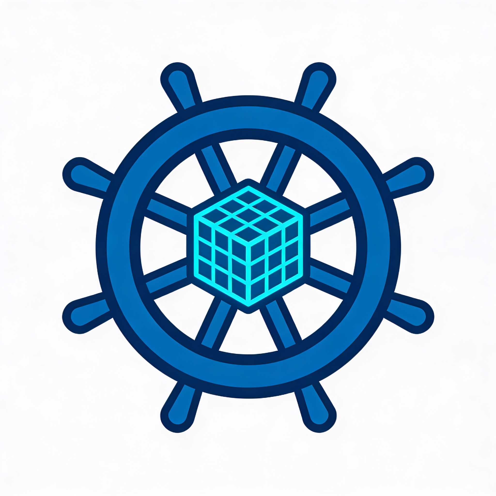
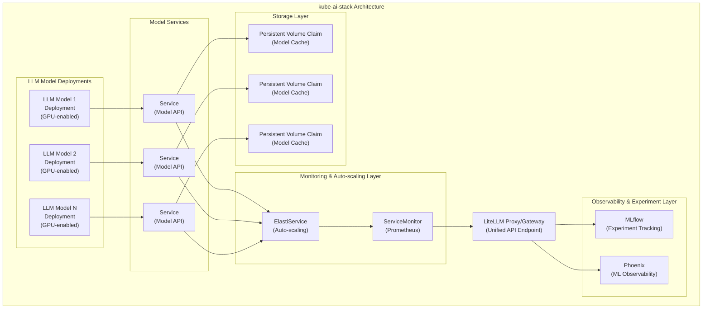

# kube-ai-stack

A solution inspired by the [kube-prometheus-stack](https://github.com/prometheus-community/helm-charts/tree/main/charts/kube-prometheus-stack) with the intention of providing an 'all-in-one' ai platform. At the moment, it's geared towards [my homelab](https://docs.bhamm-lab.com/ai/), but I ensure it is agnostic to any LLMOps/MLOps kubernetes environment. **Feedback is welcome!**




### Key Features

- **Multi-Model Support**: Deploy and manage multiple LLM models simultaneously on limited hardware
- **GPU Agnostic**: Supports gpu operators through resource requests/limists (examples with AMD)
- **Auto-scaling**: Intelligent scale-to-zero capabilities via [KubeElasti](https://kubeelasti.dev/) integration
- **AI Gateway**: [LiteLLM](https://www.litellm.ai/) proxy for consistent model access and routing
- **Monitoring**: Built-in Prometheus metrics and healthcheck monitoring
- **Persistent Storage**: Model caching with configurable PVC storage
- **Model customization**: Jinja2 prompt templates configmap and bring-your-own-container approach to support diverse backends and hardware
- **HuggingFace Integration**: Seamless model loading from HuggingFace Hub
- **MLOps**: [MLflow](https://mlflow.org/) subchart for traditional ML experimentation and model registry
- **LLMOps**: [Arise Phoenix](https://phoenix.arize.com/) subchart for GenAI tracing and evaluation

### Architecture




## Use Cases

### Homelab
- This is what it was originally created for
- Enables testing the latest OSS models and quickly have them available in LiteLLM gateway
- Optimize the runtime based on your hardware, but standardize the serving later
- Scale-to-zero to enable multiple models on limited hardware

### Dev Clusters and Experimentation
- Clusters in lower environments used by ML/AI Engineers
- Ability to quickly test new OSS models
- Scale-to-zero enabled for cost effectiveness in off-hours

### Production
- At the moment, I wouldn't necessarily recommend this
- However, in theory, with kube elasti scaling disabled, this is feasible. Or if you can handle cold start latency, this could work


## Quick Start

### Prerequisites

- Kubernetes cluster (v1.19+)
- GPU operators installed
- Helm 3.x
- kubectl configured for your cluster

### Installation

```bash
# Clone the repository
git clone <repository-url>
cd kube-ai-stack

# Install the Helm chart
helm install my-ai-stack charts/kube-ai-stack

# Or install with custom configuration
helm install my-ai-stack charts/kube-ai-stack -f my-values.yaml
```

### Verify Installation

```bash
# Check deployment status
kubectl get deployments -n models

# Check services
kubectl get services -n models

# Check pod status
kubectl get pods -n models
```

### Configuration

The stack is highly configurable through Helm values. Key configuration areas include:

- **Global Settings**: Namespace, image repository, resource defaults, subcharts
- **Model Definitions**: Individual model configurations and parameters
- **LiteLLM Settings**: Gateway configuration and routing behavior
- **Auto-scaling**: Scaling policies and trigger conditions
- **Resource Management**: CPU, memory, and GPU allocation
- **Storage**: PVC configuration and storage class selection
- **Subcharts**: Customize subcharts like MLflow and Arise Phoenix

For detailed configuration options, see the [chart README](charts/kube-ai-stack/README.md).

## Contributing

Contributions are welcome! Please feel free to submit issues, feature requests, or pull requests.


## Roadmap
- In the short run, integrate the remaining subcharts leverage in my homelab cluster: qdrant, litellm, openwebui, searxng
- In the med run, automated CI/CD, linting, pre-commit for testing and publishing of images
- In the long run, integration testing and getting started docs in some platform
